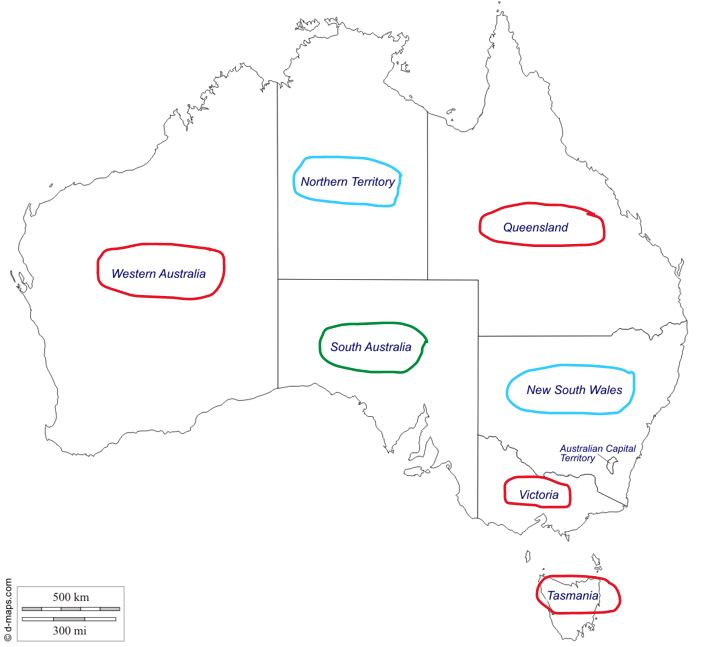
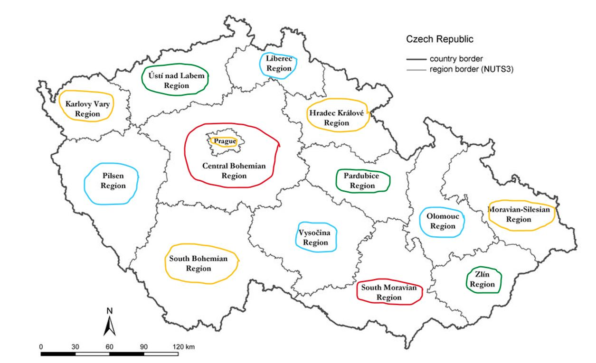

# Barvení grafu (2. cvičení)

V tomto úkolu jsem implementoval dva algoritmy pro CSP problém barvení grafu.

První metodou je **backtracking**, který jsem použil pro obarvení mapy **Austrálie** třemi barvami.

Druhou metodou je **backjumping**, který jsem použil pro obarvení mapy **České Republiky** čtyřmi barvami.

Jako bonus jsem implementoval i třetí přístup, kde úlohu barvení mapy Austrálie řeším pomocí MiniZinc solveru.

## 1) Výstup backtrackingu pro Austrálii:

All nodes have been assigned a color!

{'WA': 'R', 'NT': 'B', 'SA': 'G', 'Q': 'R', 'NSW': 'B', 'V': 'R', 'T': 'R'}

## 2) Výstup backjumpingu pro ČR:

All nodes have been assigned a color!

{'Hlavní město Praha': 'O', 'Jihočeský kraj': 'O', 'Jihomoravský kraj': 'R', 'Karlovarský kraj': 'O', 
'Královehradecký kraj': 'O', 'Liberecký kraj': 'B', 'Moravskoslezský kraj': 'O', 'Olomoucký kraj': 'B', 
'Pardubický kraj': 'G', 'Plzeňský kraj': 'B', 'Středočeský kraj': 'R', 'Ústecký kraj': 'G', 'Vysočina': 'B', 
'Zlínský kraj': 'G'}

## 3) MiniZinc

Definice problému pro MiniZinc je v [tomto souboru](./minizinc_australia.txt). Jednotlivé barvy jsou reprezentovány čísly 1, 2, 3.

### Output

Running untitled_model.mzn

wa=3

nt=2

sa=1

q=3

nsw=2

v=3

t=1

----------

Finished in 596msec