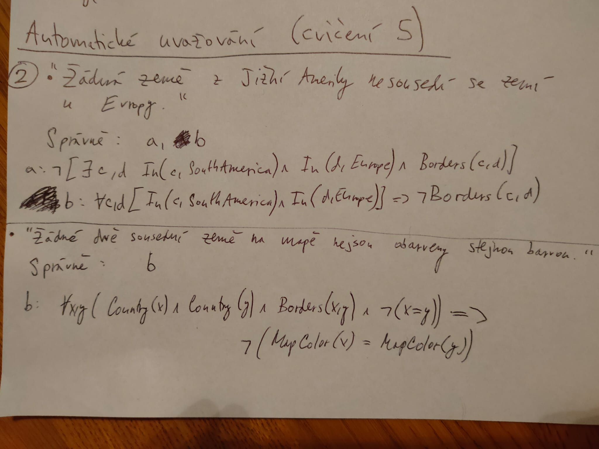
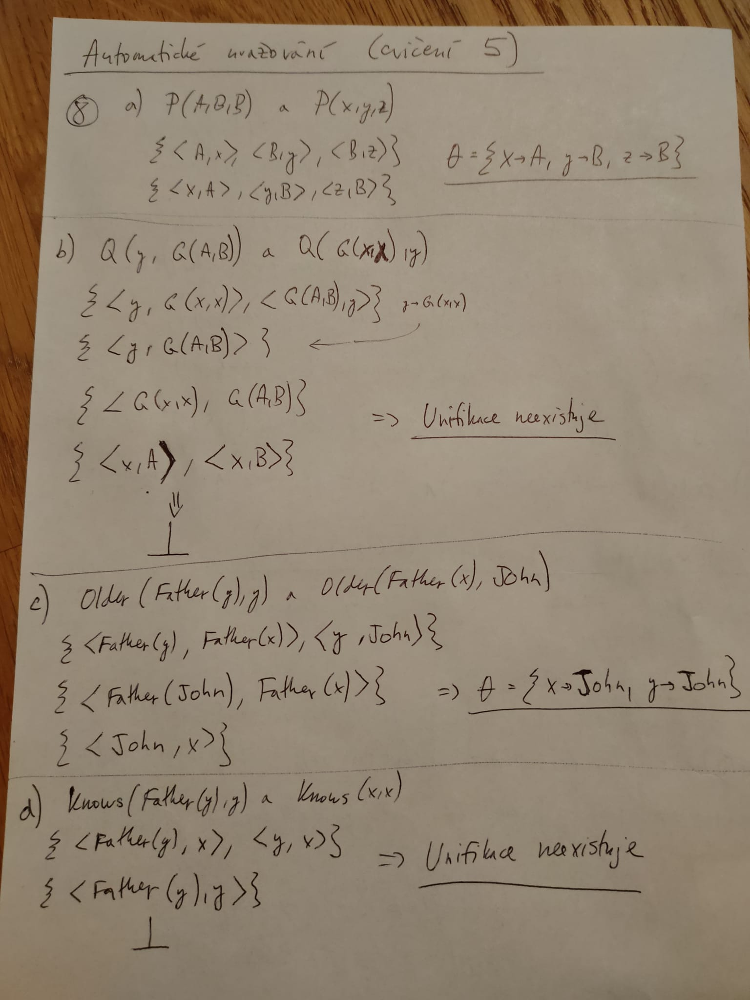
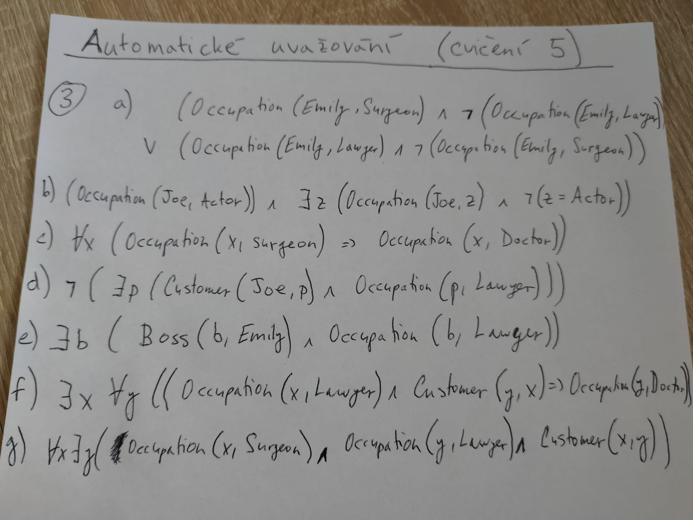

# Automatic Reasoning

Na následujících obrázkách jsou mé postupy při ručním řešení problémů automatického uvažování z 5. cvičení.

### 2)

Modelování různých znalostí v logice prvního řádu. Rozhodněte, které z následujících
formulí korektně reprezentují skutečnost (znalost): „žádná země z Jižní Ameriky nesousedí se
zemí u Evropy“:

a) ¬[∃𝑐, 𝑑 𝐼𝑛(𝑐, 𝑆𝑜𝑢𝑡ℎ𝐴𝑚𝑒𝑟𝑖𝑐𝑎) ∧ 𝐼𝑛(𝑑, 𝐸𝑢𝑟𝑜𝑝𝑒) ∧ 𝐵𝑜𝑟𝑑𝑒𝑟𝑠(𝑐, 𝑑)]

b) ∀𝑐, 𝑑 [𝐼𝑛(𝑐, 𝑆𝑜𝑢𝑡ℎ𝐴𝑚𝑒𝑟𝑖𝑐𝑎) ∧ 𝐼𝑛(𝑑, 𝐸𝑢𝑟𝑜𝑝𝑒)] ⇒ ¬𝐵𝑜𝑟𝑑𝑒𝑟𝑠(𝑐, 𝑑)

c) ¬∀𝑐 𝐼𝑛(𝑐, 𝑆𝑜𝑢𝑡ℎ𝐴𝑚𝑒𝑟𝑖𝑐𝑎) ⇒ ∃𝑑 𝐼𝑛(𝑑, 𝐸𝑢𝑟𝑜𝑝𝑒) ∧ ¬𝐵𝑜𝑟𝑑𝑒𝑟𝑠(𝑐, 𝑑)

d) ∀𝑐 𝐼𝑛(𝑐, 𝑆𝑜𝑢𝑡ℎ𝐴𝑚𝑒𝑟𝑖𝑐𝑎) ⇒ ∀𝑑 𝐼𝑛(𝑑, 𝐸𝑢𝑟𝑜𝑝𝑒) ⇒ ¬𝐵𝑜𝑟𝑑𝑒𝑟𝑠(𝑐, 𝑑)

Obdobně, rozhodněte, které z následujících formulí korektně reprezentují skutečnost
(znalost): „žádné dvě sousední země na mapě nejsou obarveny stejnou barvou“:

a) ∀𝑥, 𝑦 ¬𝐶𝑜𝑢𝑛𝑡𝑟𝑦(𝑥) ∨ ¬𝐶𝑜𝑢𝑛𝑡𝑟𝑦(𝑦) ∨ ¬𝐵𝑜𝑟𝑑𝑒𝑟𝑠(𝑥, 𝑦) ∨
¬(𝑀𝑎𝑝𝐶𝑜𝑙𝑜𝑟(𝑥) = 𝑀𝑎𝑝𝐶𝑜𝑙𝑜𝑟(𝑦))

b) ∀𝑥, 𝑦 (𝐶𝑜𝑢𝑛𝑡𝑟𝑦(𝑥) ∧ 𝐶𝑜𝑢𝑛𝑡𝑟𝑦(𝑦) ∧ 𝐵𝑜𝑟𝑑𝑒𝑟𝑠(𝑥, 𝑦) ∧ ¬(𝑥 = 𝑦)) ⇒
¬(𝑀𝑎𝑝𝐶𝑜𝑙𝑜𝑟(𝑥) = 𝑀𝑎𝑝𝐶𝑜𝑙𝑜𝑟(𝑦))

c) ∀𝑥, 𝑦 𝐶𝑜𝑢𝑛𝑡𝑟𝑦(𝑥) ∧ 𝐶𝑜𝑢𝑛𝑡𝑟𝑦(𝑦) ∧ 𝐵𝑜𝑟𝑑𝑒𝑟𝑠(𝑥, 𝑦) ∧
¬(𝑀𝑎𝑝𝐶𝑜𝑙𝑜𝑟(𝑥) = 𝑀𝑎𝑝𝐶𝑜𝑙𝑜𝑟(𝑦))

d) ∀𝑥, 𝑦 (𝐶𝑜𝑢𝑛𝑡𝑟𝑦(𝑥) ∧ 𝐶𝑜𝑢𝑛𝑡𝑟𝑦(𝑦) ∧ 𝐵𝑜𝑟𝑑𝑒𝑟𝑠(𝑥, 𝑦)) ⇒
(𝑀𝑎𝑝𝐶𝑜𝑙𝑜𝑟(𝑥 ≠ 𝑦))

### 3)

Uvažujte následující predikátové symboly s uvedeným významem a konstanty:

𝑂𝑐𝑐𝑢𝑝𝑎𝑡𝑖𝑜𝑛(𝑝, 𝑜) – osoba 𝑝 má zaměstnání 𝑜,

𝐶𝑢𝑠𝑡𝑜𝑚𝑒𝑟(𝑝1, 𝑝2) – osoba 𝑝1 je zákazníkem osoby 𝑝2,

𝐵𝑜𝑠𝑠(𝑝1, 𝑝2) – osoba 𝑝1 je nadřízeným osoby 𝑝2,

𝐷𝑜𝑐𝑡𝑜𝑟, 𝑆𝑢𝑟𝑔𝑒𝑜𝑛, 𝐿𝑎𝑤𝑦𝑒𝑟, 𝐴𝑐𝑡𝑜𝑟 – konstanty označující zaměstnání,

𝐸𝑚𝑖𝑙𝑦,𝐽𝑜𝑒 – konstanty označující osoby.

Pomocí uvedených predikátů a konstant vyjádřete formulí logiky prvního řádu následující
skutečnosti:

a) „Emily je buď chirurg, nebo právník.“

b) „Joe je herec, ale má ještě další zaměstnání.“

c) „Všichni chirurgové jsou lékaři.“

d) „Joe nemá právníka.“

e) „Emily má nadřízeného, který je právník.“

f) „Existuje právník, jehož všichni zákazníci jsou lékaři.“

g) „Každý chirurg má právníka.“

### 8)

Pro každou dvojici atomů nalezněte nejobecnější unifikaci, jestliže taková existuje:

a) 𝑃(𝐴, 𝐵, 𝐵) a 𝑃(𝑥, 𝑦, 𝑧)

b) 𝑄(𝑦, 𝐺(𝐴, 𝐵)) a 𝑄(𝐺(𝑥, 𝑥), 𝑦)

c) 𝑂𝑙𝑑𝑒𝑟(𝐹𝑎𝑡ℎ𝑒𝑟(𝑦), 𝑦) a 𝑂𝑙𝑑𝑒𝑟(𝐹𝑎𝑡ℎ𝑒𝑟(𝑥),𝐽𝑜ℎ𝑛)

d) 𝐾𝑛𝑜𝑤𝑠(𝐹𝑎𝑡ℎ𝑒𝑟(𝑦), 𝑦) a 𝐾𝑛𝑜𝑤𝑠(𝑥, 𝑥)

